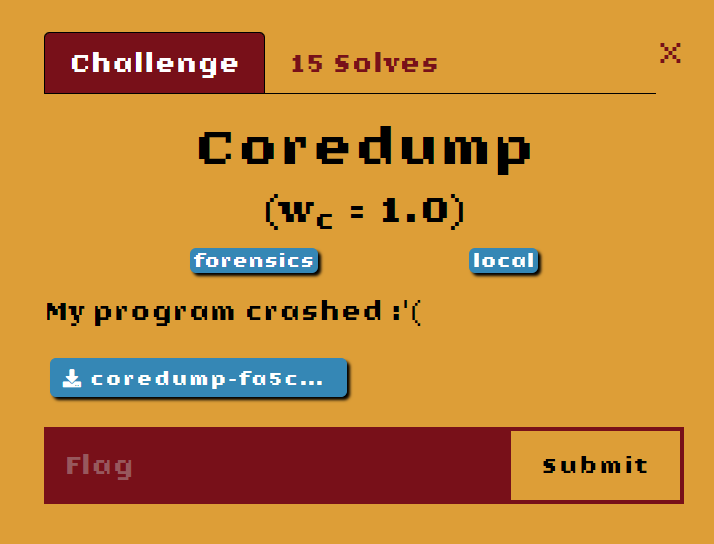

# FE CTF 22
Every year the Danish Intelligence Service make a CTF. The top 10 teams gets to go to a final on-site. 
The competitions weight on ctf-time is 25.00, so it is a pretty hard CTF. My team came on a 13th place, 
so we are definitely going for top 10 in 2023.


## Initial inspection
We first check that the file is indeed a core dump, which the challenge suggests:
```bash
ile core 
core: ELF 64-bit LSB core file, x86-64, version 1 (SYSV), SVR4-style, from './coredump', real uid: 1000, effective uid: 1000, real gid: 1000, effective gid: 1000, execfn: './coredump', platform: 'x86_64'
```
## Finding point of crash
The file is an ELF core dump, so we can go straight to GDB and figure out when or why it crashed:
```bash
gdb --core ./core 
```
We immediately see a backtrace(otherwise do `bt`), with some addresses starting with 0x55 and some with 0x7f.
If we do `vmmap` we can see that the 0x55 are the program itself, while 0x7f is libc. So we definitely want to investigate the 0x55 addreses.
We can start by examining the point where the program crashed (`0x55ff00686244`) in GDB, here we print the 5 instructions before and 5 after the crash:
```asm
x/10i 0x55ff00686244-5
   0x55ff0068623f:      push   rbp
   0x55ff00686240:      mov    rbp,rsp
   0x55ff00686243:      int3
=> 0x55ff00686244:      mov    eax,0x0
   0x55ff00686249:      call   0x55ff00686125
   0x55ff0068624e:      nop
   0x55ff0068624f:      pop    rbp
   0x55ff00686250:      ret
   0x55ff00686251:      cs nop WORD PTR [rax+rax*1+0x0]
   0x55ff0068625b:      nop    DWORD PTR [rax+rax*1+0x0]

```
Okay, `int3` actually means Trap to debugger. Which makes the program halt, the challenge creator probably then created a core dump from that point.
## Finding the flag
The program halted right before a call to a function: `0x55ff00686125` let's check that out in IDA:
```c
signed __int64 sub_55FF00686125()
{
  char buf[8]; // [rsp+0h] [rbp-30h] BYREF
  char v2[32]; // [rsp+8h] [rbp-28h] BYREF
  char v3; // [rsp+2Bh] [rbp-5h]
  unsigned int i; // [rsp+2Ch] [rbp-4h]

  *(_QWORD *)buf = 0x2D30053933293432LL;
  strcpy(v2, ":b&0-b8158e!b1:b&0-b/ 1.b5)?H");
  for ( i = 0; i <= 0x24; ++i )
  {
    v3 = buf[i];
    v3 ^= 0x42u;
    if ( v3 > 64 && v3 <= 90 )
      v3 = (v3 - 100) % 26 + 90;
    if ( v3 > 96 && v3 <= 122 )
      v3 = (v3 - 132) % 26 + 122;
    buf[i] = v3;
  }
  return sys_write(1u, buf, 0x25uLL);
}
```
This seems to be decrypting the values defined in buf. And if we make our own little c program and print out `buf`,
we see that it is indeed printing `flag{Whe[`, but not anything else.
The whole buffer seems to be decrypted properly, so the rest of the flag must be hidden in the v2 variable,
where the string `:b&0-b8158e!b1:b&0-b/ 1.b5)?H` is loaded into. 
As the decrypt function actually seems to be capable of decrypting 36 characters, which is more than just the 8 characters in the buffer,
it seems that we can use it for decrypting the 29 character long string. 
The file [core_flag_print.c](core_flag_print.c) is an altered version of the broken decryption function, and here's the output:
```bash
flag{WheRRRRRRRRRRRRRRRRRRRRRRRRRRRRRRRRRn the pimp's in the crib ma}
RRRRRRRRRRRR 
```
This is not a perfect output, but it is easy to see that the `R`'s just need to be removed: 
`flag{When the pimp's in the crib ma}`