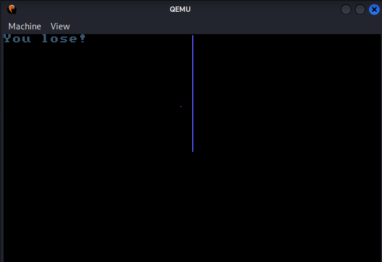

# T-dc-RON
## TDCNET CTF
The TDCNET CTF was a medium level CTF. Not on CTF-time because physical participation was a part of the rules. A few people from Cyberlandsholdet was also present at the event, which was nicely hosted at TDC at their headquarters in Copenhagen.

## Initial inspection
We are handed over a `game` binary and a `run.sh`, specifying that we have to run it like so:

`qemu-system-i386 -fda gameOriginal.bin`

Running requires the QEMU emulator and also a linux UI version, as the game needs graphics to render. Starting the game and just letting it run will cause the game to end in a losing state when the snake hits a wall:

So it is a snake game. However, the points are tiny, making it hard to hit them, and the snake only 'stretches' - it does not move! So it is safe to say that it will be impossible to win the game in this state. 

## Inspection
Time to take a look at the disassembly. I am saying disassembly because it is a 16-bit game which IDA cannot decompile into c pseudocode:
```asm
seg000:0000 seg000          segment byte public 'CODE' use16
seg000:0000                 assume cs:seg000
seg000:0000                 assume es:nothing, ss:nothing, ds:nothing, fs:nothing, gs:nothing
seg000:0000                 mov     ah, 0
seg000:0002                 mov     al, 13h
seg000:0004                 int     10h             ; - VIDEO - SET VIDEO MODE
seg000:0004                                         ; AL = mode
seg000:0006                 call    sub_3E
seg000:0009                 call    sub_E
seg000:000C ; ---------------------------------------------------------------------------
seg000:000C
seg000:000C loc_C:                                  ; CODE XREF: seg000:loc_C↓j
seg000:000C                 jmp     short loc_C
seg000:000E
seg000:000E ; =============== S U B R O U T I N E =======================================
seg000:000E
seg000:000E ; Attributes: noreturn
seg000:000E
seg000:000E sub_E           proc near               ; CODE XREF: seg000:0009↑p
seg000:000E                                         ; sub_E+1F↓j
seg000:000E                 call    sub_141
seg000:0011                 mov     cx, ds:7D92h
seg000:0015                 mov     dx, ds:7D98h
seg000:0019                 cmp     cx, 1A4h
seg000:001D                 jz      loc_17E
seg000:0021                 cmp     cx, dx
seg000:0023                 jz      short loc_28
seg000:0025                 call    sub_3E
seg000:0028
seg000:0028 loc_28:                                 ; CODE XREF: sub_E+15↑j
seg000:0028                 mov     al, 9
seg000:002A                 call    sub_91
seg000:002D                 jmp     short sub_E
seg000:002D sub_E           endp
```
Above we see the start of the game, where:
- A function is called
- A Global variable is compared to 420
  - Jumps to some function if equal.
- Two global variables compared, if not equal:
  - call a function.
- Call another function
- Jump back to the start of the function.

It seems like this is already the game update loop. The whole binary is only 391 lines, so it could be realistic to reverse engineer the whole game, in order to do possible solutions:
1. Simulate the decryption of the flag
2. Patch the game to win it easily, and hopefully the flag will show at a point before 420 points is gathered.

Decryption simulation in a python script seems the best way to go, but the steps of patching the game and clearing it also seems like a good tactic, especially if the decryption relies on many different parts of the game.

Looking for traces of the flag in the binary we quickly see TDCNET{:
```bash
7D EB EC EB F9 EB FE 64  00 A0 00 40 01 C8 00 00  }..........@....
01 00 00 00 00 00 00 00  01 00 59 6F 75 20 77 69  ..........You wi
6E 21 00 59 6F 75 20 6C  6F 73 65 21 00 54 44 43  n!.You lose!.TDC
4E 45 54 7B 30 04 84 99  9F 71 75 1F 33 70 F0 1F  NET{0....qu.3p..
```
The actual value of the flag is encrypted, looking more into the assembly, it becomes clear where decryption is done:
```asm
seg000:00D2                 mov     si, 7DB4h       ; encrypted flag pos in memory
seg000:00D5                 mov     di, ds:7D98h    ; define current index
seg000:00D9                 and     di, 0Fh         ; max of 16
seg000:00DC                 add     si, di          ; which part of the flag to decrypt
seg000:00DE                 mov     ch, [si]        ; move encrypted val to be decrypted
seg000:00E0                 mov     dh, ds:7D94h    ; mov current xor val to be xored
seg000:00E4                 xor     ch, dh
seg000:00E6                 mov     [si], ch        ; update the flag with the decrypted value
seg000:00E8                 inc     byte ptr ds:7D98h
seg000:00EC                 retn
```
The comments are for annotating the 'global variables' which are references to parts in memory can be xref'ed by IDA allowing us to see where they are used. 
From checking the variables it looks like it is the x-value of the snake head which is used to generate the key for xor'ing one byte in the flag.
The binary seems to do decryption in rounds of 16 which means the flag will be 16 characters long. However, we do not know how many rounds the flag has to be decrypted (even though the game suggests 420).

## Patching & Debugging
For a clearer understanding, we will have to debug the binary. Luckily QEMU supports gdb, and with the flags `-s` and `-S` QEMU will launch the game in a paused state and start a debugging server, which gdb can connect to:

`qemu-system-i386 -fda game.bin -s -S`

And for GDB:

`target remote localhost:1234`

To speed things up we can patch the binary, so we will not loose, and remove any delays in the execution, so the snake will go faster as well. 
```asm
seg000:0165                 mov     dx, 62022 ; microseconds to wait, we'll half this to get double speed.
...
seg000:0x94:0xD1 -> nop all ; nop all checks for hitting boundaries and the snake body (causing us to loose)
```
This can be done in IDA: `Edit->Patch program->Assemble...` after this `Edit->Patch Program->Apply patches to input file...`
Be aware that when removing patches in IDA. The patches will not be reverted when re-patching. So better take an original backup and patch that.

Secondly, we also create a GDB script `gdb_script.txt`, so we do not have to go in and out of the game each time we hit a breakpoint.
We initially set a breakpoint just after the decryption after we scored a point. When this breakpoint is hit we print the value at 0x7DB4. 
As this is the address from where the decryption function mutates/decrypts the flag. 

Running the game and gdb with `gdb -x gdb_script.txt ./game_nodiefaster.bin`, we see the two strings in GDB:
```bash
Breakpoint 1, 0x00007cec in ?? ()
0x7dad: "TDCNET{0\222\204\231\237qu\0373p\360\037&\225\216\341}"
0x7db4: "0\222\204\231\237qu\0373p\360\037&\225\216\341}"
... about 7 points scored
0x7dad: "TDCNET{\222D\256\207\355WO\261\261ƺ!\264\323\324/}"
0x7db4: "\222D\256\207\355WO\261\261ƺ!\264\323\324/}"
```
after scoring some points, we can see that the flag is decrypting and that the two locations in memory are the same, just with and without the TDCNET{. While unsure how many points it will take to decrypt the flag it seems feasible to try and play the game for a few minutes:
```bash
Breakpoint 1, 0x00007cec in ?? ()
0x7dad: "TDCNET{0\222\204\231\237qu\0373p\360\037&\225\216\341}"
Breakpoint 1, 0x00007cec in ?? ()
0x7dad: "TDCNET{0\222\256\231\237qu\0373p\360\037&\225\216\341}"
0x7dad: "TDCNET{0\222\256\207\237qu\0373p\360\037&\225\216\341}"
0x7dad: "TDCNET{0\222\256\207\355qu\0373p\360\037&\225\216\341}"
0x7dad: "TDCNET{0\222\256\207\355Wu\0373p\360\037&\225\216\341}"
0x7dad: "TDCNET{0\222\256\207\355WO\0373p\360\037&\225\216\341}"
0x7dad: "TDCNET{0\222\256\207\355WO\2613p\360\037&\225\216\341}"
0x7dad: "TDCNET{0\222\256\207\355WO\261\261p\360\037&\225\216\341}"
0x7dad: "TDCNET{0\222\256\207\355WO\261\261\306\360\037&\225\216\341}"
0x7dad: "TDCNET{0\222\256\207\355WO\261\261ƺ\037&\225\216\341}"
0x7dad: "TDCNET{0\222\256\207\355WO\261\261ƺ!&\225\216\341}"
0x7dad: "TDCNET{0\222\256\207\355WO\261\261ƺ!\264\225\216\341}"
0x7dad: "TDCNET{0\222\256\207\355WO\261\261ƺ!\264ӎ\341}"
0x7dad: "TDCNET{0\222\256\207\355WO\261\261ƺ!\264\323\324\341}"
0x7dad: "TDCNET{0\222\256\207\355WO\261\261ƺ!\264\323\324/}"
0x7dad: "TDCNET{\222\222\256\207\355WO\261\261ƺ!\264\323\324/}"
0x7dad: "TDCNET{\222D\256\207\355WO\261\261ƺ!\264\323\324/}"
0x7dad: "TDCNET{\222Dć\355WO\261\261ƺ!\264\323\324/}"
0x7dad: "TDCNET{\222D\304\331\355WO\261\261ƺ!\264\323\324/}"
0x7dad: "TDCNET{\222D\304\331_WO\261\261ƺ!\264\323\324/}"
0x7dad: "TDCNET{\222D\304\331_1O\261\261ƺ!\264\323\324/}"
0x7dad: "TDCNET{\222D\304\331_15\261\261ƺ!\264\323\324/}"
0x7dad: "TDCNET{\222D\304\331_15_\261ƺ!\264\323\324/}"
0x7dad: "TDCNET{\222D\304\331_15_sƺ!\264\323\324/}"
0x7dad: "TDCNET{\222D\304\331_15_s0\272!\264\323\324/}"
0x7dad: "TDCNET{\222D\304\331_15_s00!\264\323\324/}"
0x7dad: "TDCNET{\222D\304\331_15_s00_\264\323\324/}"
0x7dad: "TDCNET{\222D\304\331_15_s00_f\323\324/}"
0x7dad: "TDCNET{\222D\304\331_15_s00_fU\324/}"
0x7dad: "TDCNET{\222D\304\331_15_s00_fUN/}"
0x7dad: "TDCNET{\222D\304\331_15_s00_fUN!}"
0x7dad: "TDCNET{pD\304\331_15_s00_fUN!}"
0x7dad: "TDCNET{pR\304\331_15_s00_fUN!}"
0x7dad: "TDCNET{pRn\331_15_s00_fUN!}"
0x7dad: "TDCNET{pRnG_15_s00_fUN!}"
0x7dad: "TDCNET{pRnG\25515_s00_fUN!}"
0x7dad: "TDCNET{pRnG\255\2275_s00_fUN!}"
```
After scoring 32 points the flag is successfully decrypted! It can also be seen that the flag gets encrypted again. 
It does this cycle all the way to 420, so it can also be seen decrypted after 96 points and so on. 

## Final remarks
I took a very long time reversing the binary entirely before being able to patch it correctly. The key was definitely using the GDB debugger to print the data segment values. 
Without debugger, the trial and error of patching and running would have been far too big.